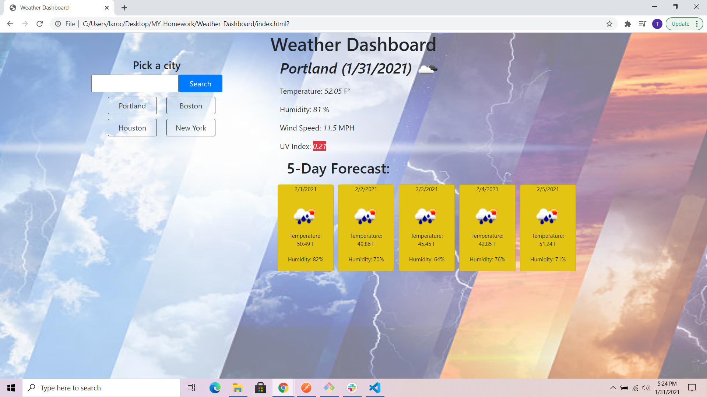

# Weather-Dashboard

##Overview
This website allows you to check the weather anywhere in the United States. You write the city for whom's weather you would like in the search input and then press the button. That makes a city button that when you press on it it shows you the weather for today and a five day forcast. You can have multiable city buttons and you can change bewteen them by click on a different city. The city button will save when you reload the page.

##Link
https://taroche.github.io/Weather-Dashboard/

##Picture
